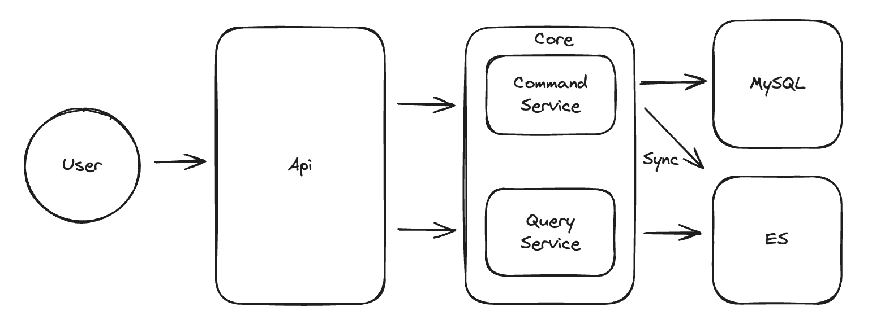

# Devlog

## 프로젝트 소개

블로그 플랫폼 프로젝트

## 아키텍처



## 기술 스택

- Java 17
- Spring Boot 3.4.2
- Gradle
- JUnit5
- JaCoCo (테스트 커버리지)
- Lombok
- Spring Data JPA
- Spring Data Elasticsearch
- MySQL
- H2 Database (개발/테스트용)
- JWT

## 모듈 구조

프로젝트는 다음과 같은 모듈로 구성되어 있습니다:

#### `api`

- REST API 엔드포인트 및 컨트롤러 구현
- 요청/응답 DTO 처리
- 보안 설정

#### `core`

- 핵심 비즈니스 로직
- 서비스 레이어 구현
- 도메인 모델

#### `common`

- 공통 유틸리티 클래스
- 예외 처리
- 상수

#### `infra`

- 데이터베이스 연동
- 외부 서비스 통합
- 인프라 관련 구성

#### `support`

- 개발 지원 도구
- 테스트 커버리지 도구 (JaCoCo)

## 주요 기능

- 사용자 관리 (회원가입, 로그인)
- 포스트 작성 및 관리
- 댓글 기능
- 좋아요 기능

## 개발 환경 설정

#### 요구사항

- JDK 17 이상
- Gradle 7.x 이상

#### 빌드 및 실행

```bash
# 프로젝트 클론
git clone https://github.com/username/devlog.git
cd devlog

# 빌드
./gradlew build

# 실행
./gradlew :api:bootRun --args='--GITHUB_API_CLIENT_ID={깃허브_클라이언트_아이디} --MYSQL_PASSWORD={MySQL_패스워드} --MYSQL_USERNAME={MySQL_유저네임} --GITHUB_API_CLIENT_SECRET={깃허브_클라이언트_시크릿}'
```

## 테스트

```bash
# 전체 테스트 실행
./gradlew test

# 테스트 커버리지 리포트 생성
./gradlew jacocoTestReport
```

테스트 커버리지 리포트는 api 모듈의 `build/customJacocoReportDir` 디렉토리에서 확인할 수 있습니다.
